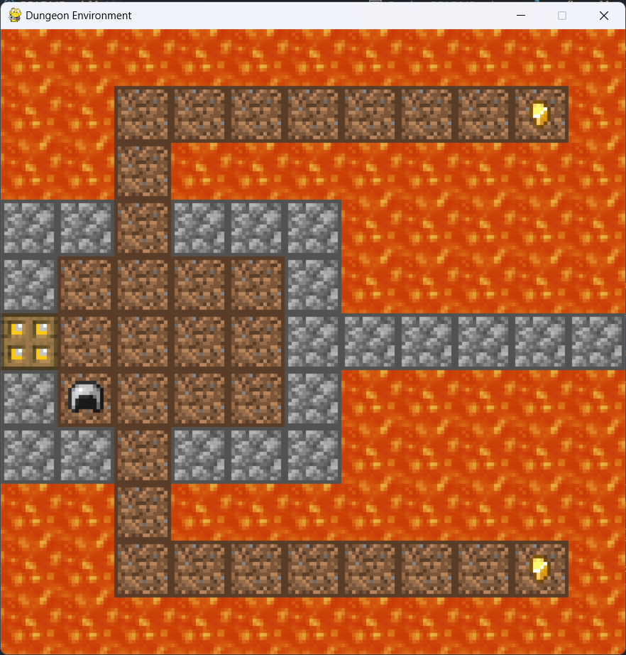
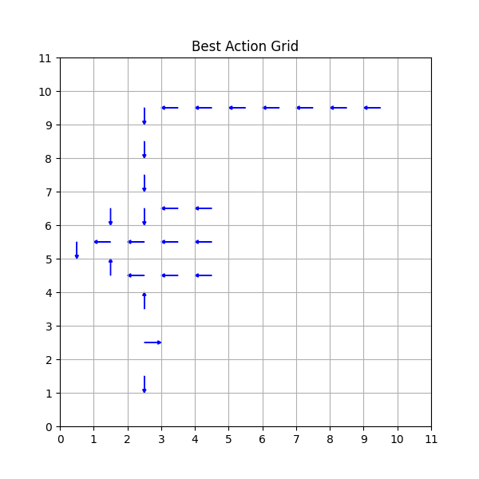
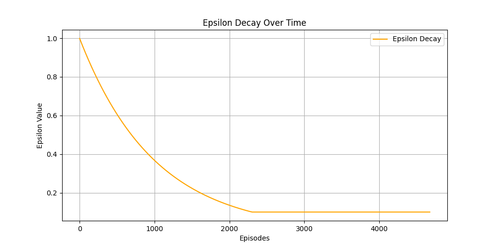

# Dungeon Reinforcement Learning Project

_A reinforcement learning agent navigates a dungeon grid, collects keys, and reaches the goal while avoiding hazards._

---

## Overview

This project implements a reinforcement learning (RL) agent that learns to solve a dungeon navigation task. The environment is an 11x11 grid-based dungeon with walls, keys, lava, and a goal. The agent must collect both keys and reach the goal while maximizing its cumulative reward.

<!-- Place an overview image or GIF of the environment here -->


---

## Table of Contents

- [Features](#features)
- [Project Structure](#project-structure)
- [Setup Instructions](#setup-instructions)
- [Usage](#usage)
- [Game Mechanics](#game-mechanics)
- [Training & Results](#training--results)
- [Customization](#customization)
- [Contributing](#contributing)
- [License](#license)

---

## Features

- **Custom Grid Environment:** 11x11 dungeon with walls, keys, lava, and a goal.
- **Multiple RL Agents:** Supports both single-policy and multi-policy agents.
- **Q-Learning:** Tabular Q-learning with epsilon-greedy exploration.
- **Visualization:** Real-time rendering with Pygame and result plotting with Matplotlib.
- **Experiment Logging:** Saves Q-tables, configuration, and result plots for each run.

---

## Project Structure

```
dungeon-rl-project/
├── src/
│   ├── train.py                  # Main training script
│   ├── assets/                   # Sprite assets for rendering
│   └── core/
│       ├── __init__.py
│       ├── agent.py              # Agent and AgentV2 classes
│       ├── config.py             # Configuration classes
│       ├── dungeon_env.py        # DungeonEnv environment
│       ├── policy.py             # Q-learning policy logic
│       ├── renderer.py           # Pygame renderer
│       └── visualizer.py         # Matplotlib result visualizations
├── experiments/                  # Saved experiment results
├── requirements.txt              # Python dependencies
└── README.md                     # Project documentation
```

---

## Setup Instructions

1. **Clone the repository:**
   ```sh
   git clone <repository-url>
   cd dungeon-rl-project
   ```

2. **Install dependencies:**
   ```sh
   pip install -r requirements.txt
   ```

3. **(Optional) Install Jupyter for notebooks:**
   ```sh
   pip install notebook
   ```

---

## Usage

To train an agent and visualize its learning process, run:

```sh
python src/train.py
```

- Training progress and rewards will be printed to the console.
- If rendering is enabled in the config, a Pygame window will show the agent's movement.
- Results (Q-tables, plots, config) are saved in the `experiments/` folder.

---

## Game Mechanics

- **Grid:** 11x11 cells, each can be wall, walkable, lava, key, agent, or goal.
- **Agent Actions:** Up, Down, Left, Right.
- **Rewards:**
  - Collecting a key: **+10**
  - Reaching the goal (with both keys): **+100**
  - Stepping into lava: **-10** (episode ends)
  - Hitting a wall or invalid move: **-0.1**
  - Reaching the goal without both keys: **-1**
- **Episode End:** When the agent reaches the goal with both keys or steps into lava.

<!-- Place a diagram of the grid layout here -->


---

## Training & Results

- **Q-Learning:** The agent uses tabular Q-learning with epsilon-greedy exploration.
- **Multi-Policy:** `AgentV2` uses separate Q-tables for different key-carrying states.
- **Visualization:** After training, the following plots are generated:
  - **Best Action Grid:** Shows the best action for each cell.
  - **Epsilon Decay:** Plots how exploration decreases over episodes.
  - **Reward History:** (Optional) Shows total reward per episode.

<!-- Place sample result plots here -->



---

## Customization

- **Configuration:** All environment and learning parameters are in [`src/core/config.py`](src/core/config.py).
- **Assets:** Sprite images are in [`src/assets/`](src/assets/).
- **Experiment Results:** Each run creates a timestamped folder in [`experiments/`](experiments/).

---

## Contributing

Contributions are welcome! Please open an issue or submit a pull request for improvements or bug fixes.

---

## License

This project is licensed under the MIT License. See the LICENSE file for details.
